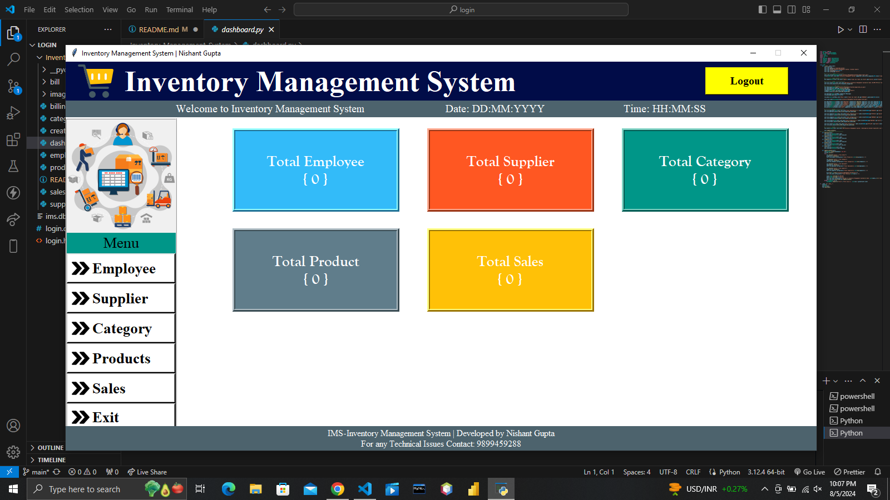
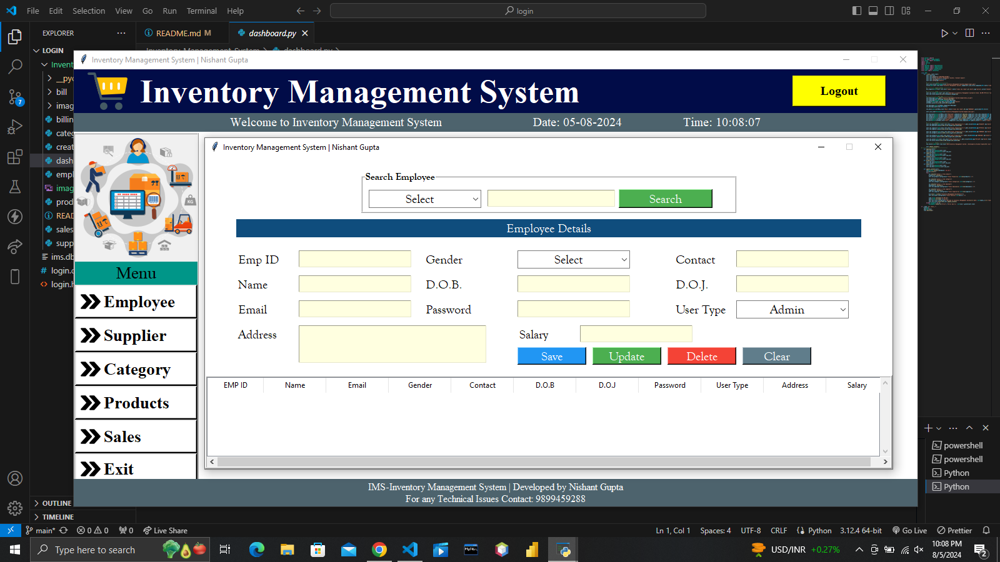
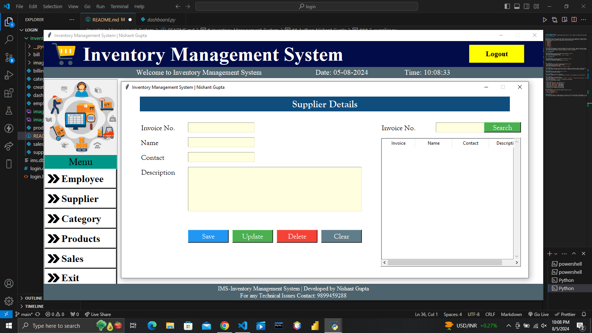
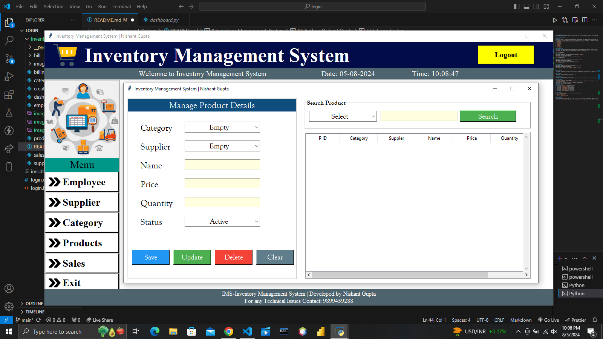
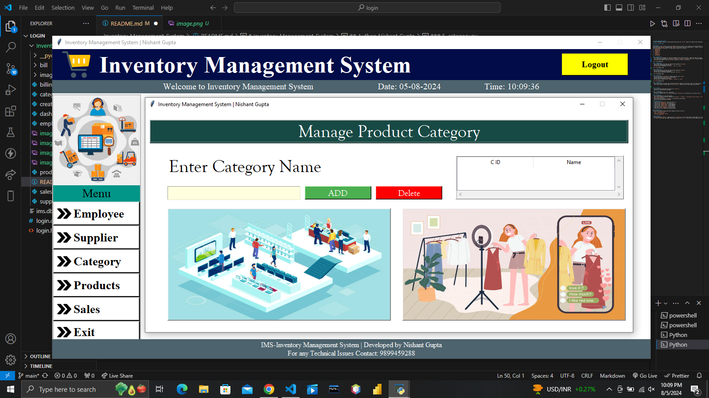
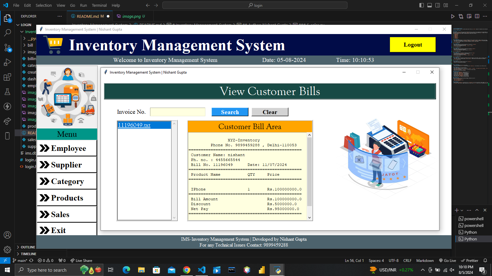
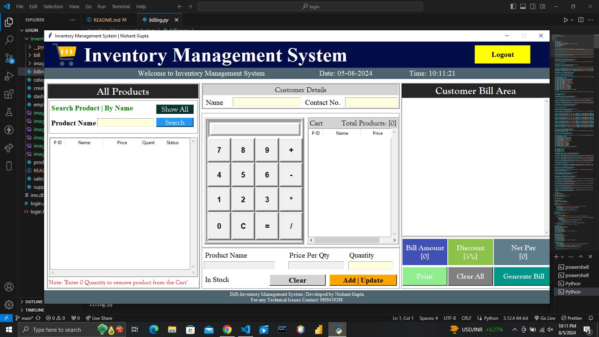

# Inventory-Management-System
Inventory Management System is a python based project that uses `tkinter` modules for Graphical User Interface(GUI)

## Author: Nishant Gupta

### Overview
This project includes 8 python scripts that demonstrate how to interact with a Graphical User Interface(GUI) using `tkinter`, manage images using `pil`, date/time using `datetime`, database using `sqlite3` and fetching files from system using `os` module. In this project, there are total 8 python scripts which are connected to each other. The eight python scripts are as follows:-
1. `dashboard.py`
2. `employee.py`
3. `supplier.py`
4. `product.py`
5. `category.py`
6. `sales.py`
7. `create_db.py`
8. `billing.py`

### 1. dashboard.py
- This script is the dashboard of Inventory Management System containing buttons, images and labels and timing.
- The screen shows the options for `Employee`, `Supplier`, `Category`, `Products` and `Sales` to perform CRUD operations.
- This screen also updates timely as you perform operations on any of these Labels.

### 2. employee.py
- This screen collects and shows the complete data regarding an `employee`.
- Buttons are functionalised accordingly.
- You can search an employee by its `email`, `name` or `contact`.

### 3. supplier.py
- This screen collects and shows the complete data regarding `suppliers`.
- Buttons are functionalised accordingly.
- You can search a particular supplier details by `invoice no`.

### 4. product.py
- This screen collects and shows the complete data about the `product`.
- It also ensures the `availability` of the product
- Buttons are functionalised accordingly.
- You can search a product by its `category`, `supplier` or `name`.

### 5. category.py
- This screen collects and shows the information about the category of the product. LIKE:- If Product name is `IPhone` then its category is `Phone`.
- This screen contains 2 buttons namely `add` and `delete`. These buttons are functionalised accordingly.

### 6. sales.py
- This screen stores and shows the bills by an `invoice no`.
- Buttons are functionalised accordingly.

### 7. creat_db.py
- This is the database file for all the tables.
- You have to run this file `first` before running the `dashboard.py` file otherwise it will throw an error.

### 8. billing.py
- This screen contains all the billing part.
- This screen contains information regarding the `products`, `customers`, `the products they are buying`, `billing structure`, `price of product`, `discout on the products`.
- This screen also contains a `calculator` to calculate the total amount.
- Buttons are functionalised accordingly.

#### Detailed Steps:
1. Click on the `create_db.py` file first and run it.
2. Click on the `dashboard.py` file and run it.
3. Click on the `employee button` to add employees.
4. Click on the `supplier button` to add suppliers.
5. Click on the `products button` to add products.
6. Now click on the `billing.py` file for billing.
7. Now click on the `dashboard.py` file and run it.
8. Click on the `sales` button to see your billing.

### Pre-Requisites
Ensure that you have the following Python Pakages installed in your PC:
- `time`: `pip install time`
- `pil`: `pip install pil`
- `sqlite3`: `pip install sqlite3`
- `os`: `pip install os`

### Configuration
- Before running `dashboard.py`, make sure to run `create_db.py` file first and create a folder named `bill` and `images`.
- In `images` folder save your images regarding this project and in `bill` folder bills will automatically be saved.